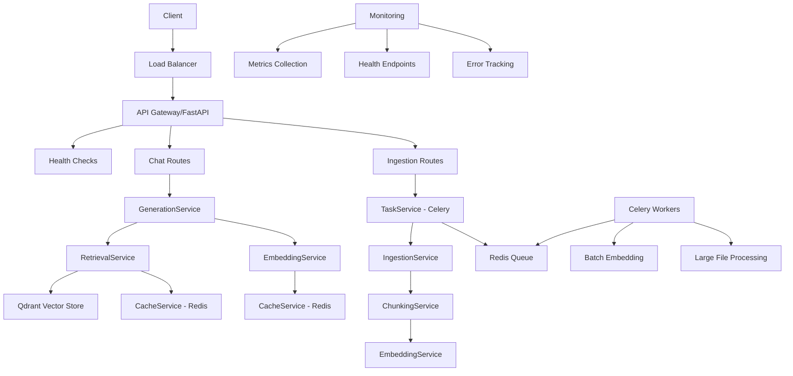

# Production-Ready RAG Backend Architecture Design

## Overview
This document outlines the architecture for a production-ready RAG (Retrieval-Augmented Generation) backend designed to support 1000+ concurrent users with cost-efficient scaling. The system maintains exact API contract compliance while introducing advanced production patterns.

## Current API Contract (Must Maintain)
- **Endpoint**: `POST /api/chat/generate-questions`
- **Request Model**: `QuestionGenerationRequest`
  - `topic: Optional[str] = None`
  - `count: Optional[int] = 25`
  - `mode: Optional[str] = "practice"` (quiz/practice modes)
- **Response Model**: `ChatResponse`
  - `response: str`
  - `timestamp: str`

## Module Structure

```
backend/
├── config/
│   ├── settings.py          # Production configuration management
│   └── __init__.py
├── models/
│   ├── chat.py              # API models (existing)
│   ├── rag.py               # New RAG-specific models
│   └── __init__.py
├── routes/
│   ├── chat.py              # Maintain existing API contract
│   ├── health.py            # Health checks and readiness
│   └── __init__.py
├── services/
│   ├── ingestion_service.py     # Document ingestion and preprocessing
│   ├── chunking_service.py      # LangChain RecursiveCharacterTextSplitter
│   ├── embedding_service.py     # Embedding generation and management
│   ├── retrieval_service.py     # Vector search and retrieval
│   ├── generation_service.py    # Question generation
│   ├── cache_service.py         # Redis-based caching (semantic + regular)
│   ├── task_service.py          # Celery task management
│   └── monitoring_service.py    # Performance monitoring
├── utils/
│   ├── cache.py             # Existing cache utilities
│   ├── logger.py            # Enhanced logging
│   └── __init__.py
└── main.py                  # FastAPI app with production middleware
```

## Service Classes and Responsibilities

### IngestionService
- **Responsibilities**:
  - Document upload and validation
  - Large file processing via Celery
  - Format conversion (PDF, DOCX, TXT)
  - Duplicate detection using file hashing
- **Patterns**: Background processing, progress tracking

### ChunkingService (Updated)
- **Responsibilities**:
  - LangChain RecursiveCharacterTextSplitter integration
  - Chunk size: 256 characters, no overlap
  - Standard separators: `["\n\n", "\n", " ", ""]`
  - Rich metadata extraction
- **Patterns**: Streaming processing, memory efficient

### EmbeddingService (Enhanced)
- **Responsibilities**:
  - Batch embedding generation
  - Embedding caching and reuse
  - Model management (BAAI/bge-large-en-v1.5)
  - Rate limiting and quota management
- **Patterns**: Async batching, circuit breaker

### RetrievalService (New)
- **Responsibilities**:
  - Qdrant vector search integration
  - Hybrid search (semantic + keyword)
  - Multi-query retrieval
  - Result reranking
  - Contextual expansion
- **Patterns**: Caching, fallback strategies

### GenerationService (New)
- **Responsibilities**:
  - Question generation from retrieved context
  - Mode-specific processing (quiz vs practice)
  - AI model orchestration (Gemini/Together.ai)
  - Response formatting
- **Patterns**: Template-based generation, async processing

### CacheService (New)
- **Responsibilities**:
  - Redis-based multi-level caching
  - Semantic cache (embeddings, retrievals)
  - Regular cache (API responses, metadata)
  - Cache invalidation strategies
- **Patterns**: TTL management, cache warming

### TaskService (New)
- **Responsibilities**:
  - Celery integration for background tasks
  - Large file ingestion processing
  - Batch embedding generation
  - Cache pre-warming
- **Patterns**: Task queuing, progress tracking, error recovery

## API Endpoint Design

### Existing Contract (Maintained)
```python
@router.post("/api/chat/generate-questions", response_model=ChatResponse)
async def generate_questions(request: QuestionGenerationRequest, http_request: Request):
    # Implementation with new architecture
```

### New Health Endpoints
```python
@router.get("/health/live")
@router.get("/health/ready")
@router.get("/metrics")
```

## Caching Strategy

### Multi-Level Caching Architecture
1. **L1 - In-Memory**: FastAPI request-level cache
2. **L2 - Redis Semantic Cache**:
   - Embeddings cache (TTL: 24h)
   - Retrieval results cache (TTL: 1h)
   - Query similarity matching
3. **L3 - Redis Regular Cache**:
   - API responses (TTL: 30m)
   - User session data (TTL: 24h)
   - Metadata cache (TTL: 1h)

### Cache Keys Design
- Embeddings: `embed:{model}:{hash(query)}`
- Retrieval: `retrieval:{token}:{filename}:{hash(query)}`
- API: `api:{endpoint}:{hash(params)}`

## Background Task Handling

### Celery Configuration
- **Broker**: Redis
- **Result Backend**: Redis
- **Queues**: `ingestion`, `embedding`, `maintenance`
- **Concurrency**: 4 workers per instance
- **Monitoring**: Flower dashboard

### Task Types
1. **Large File Ingestion**: Async document processing
2. **Batch Embedding**: Background embedding generation
3. **Cache Warming**: Proactive cache population
4. **Index Optimization**: Vector store maintenance

## Database/Vector Store Design

### Qdrant Integration (Maintained)
- **Collection**: `learning_app_documents`
- **Vector Config**: 1024 dimensions, Cosine similarity
- **Metadata Filtering**: Token-based isolation
- **Hybrid Search**: BM25 + semantic search

### Additional Storage
- **Redis**: Caching, session management, task queuing
- **SQLite**: Document tracking (existing)

## Error Handling and Fallbacks

### Circuit Breaker Pattern
- Embedding service failures → Cached embeddings
- Vector search failures → Fallback retrieval
- AI generation failures → Cached responses

### Graceful Degradation
- High load → Reduced chunk count
- API limits → Rate limiting with backoff
- Service unavailability → Cached responses

### Error Response Format
```json
{
  "status": "error",
  "message": "Service temporarily unavailable",
  "fallback_used": true,
  "retry_after": 30
}
```

## Configuration Management

### Environment-Based Config
```python
class ProductionSettings(BaseSettings):
    # Redis Configuration
    REDIS_URL: str
    REDIS_CACHE_DB: int = 0
    REDIS_TASK_DB: int = 1

    # Celery Configuration
    CELERY_BROKER_URL: str
    CELERY_RESULT_BACKEND: str

    # Performance Tuning
    MAX_CONCURRENT_REQUESTS: int = 100
    EMBEDDING_BATCH_SIZE: int = 32
    CACHE_TTL_SECONDS: int = 3600

    # Monitoring
    SENTRY_DSN: Optional[str] = None
    LOG_LEVEL: str = "INFO"
```

## Deployment Configuration

### Gunicorn + Uvicorn Setup
```python
# gunicorn.conf.py
workers = multiprocessing.cpu_count() * 2 + 1
worker_class = "uvicorn.workers.UvicornWorker"
bind = "0.0.0.0:8000"
max_requests = 1000
max_requests_jitter = 50
worker_timeout = 30
```

### Docker Configuration
```yaml
# docker-compose.yml
services:
  api:
    build: .
    environment:
      - WORKERS_PER_CORE=2
      - MAX_WORKERS=8
    deploy:
      resources:
        limits:
          memory: 2G
        reservations:
          memory: 1G
```

### Scaling Strategy
- **Horizontal Scaling**: Multiple API instances behind load balancer
- **Auto-scaling**: Based on CPU/memory utilization
- **Cost Optimization**: Spot instances with graceful shutdown
- **Global Distribution**: CDN for static assets, regional API deployment

## Production RAG Patterns Implemented

1. **Ingestion Pipeline**: Async document processing with progress tracking
2. **Chunking Strategy**: LangChain RecursiveCharacterTextSplitter with metadata
3. **Embedding Management**: Batch processing with caching and reuse
4. **Retrieval Optimization**: Multi-query with reranking and expansion
5. **Generation Quality**: Context-aware question generation with fallbacks
6. **Caching Layers**: Semantic and regular caching for performance
7. **Background Processing**: Celery for resource-intensive operations
8. **Monitoring**: Health checks, metrics, and alerting
9. **Error Resilience**: Circuit breakers and graceful degradation
10. **Cost Efficiency**: Intelligent caching and resource optimization

## Mermaid Architecture Diagram



This architecture provides a scalable, production-ready RAG backend that maintains API contract compliance while introducing advanced patterns for performance, reliability, and cost efficiency.